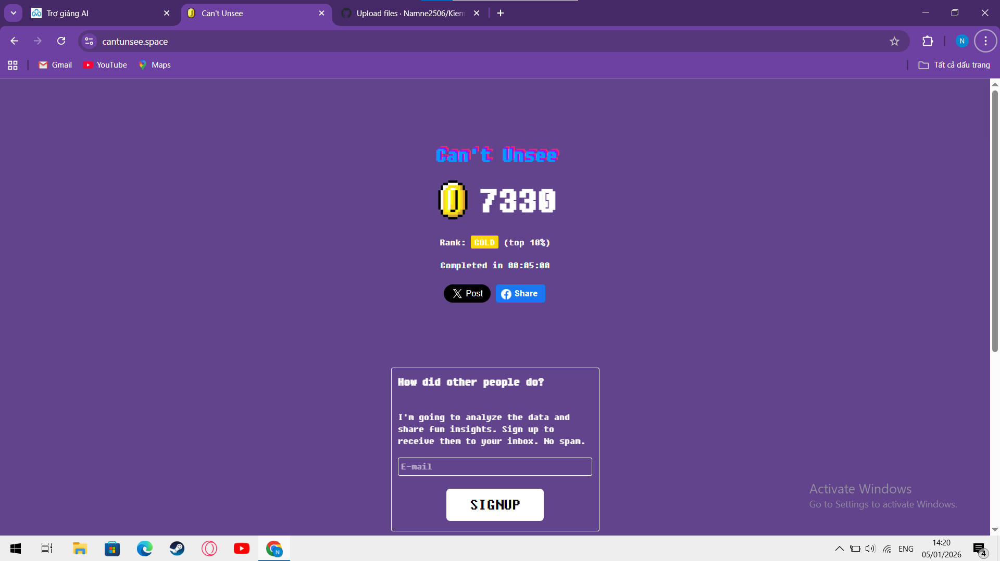
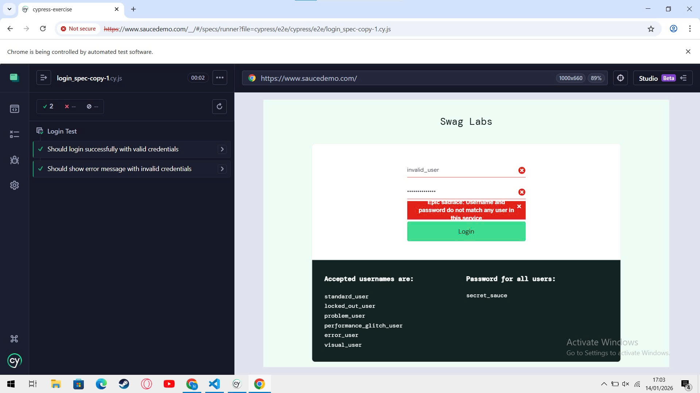

# BÁO CÁO THỰC HÀNH KIỂM THỬ PHẦN MỀM

**Sinh viên:** Nguyễn Đức Nam  
**Mã sinh viên:** BCS230062  

---

## NỘI DUNG BÁO CÁO

- Đánh giá khả năng quan sát UI/UX thông qua trò chơi *Can't Unsee*  
- Kiểm thử mức đơn vị với **JUnit** (lớp `StudentAnalyzer`)  
- Kiểm thử tự động **End-to-End** bằng **Cypress**

---

## 1. Đánh giá UI/UX với trò chơi Can't Unsee

### 1.1 Mục đích thực hành

Giao diện người dùng (UI/UX) có ảnh hưởng trực tiếp đến trải nghiệm sử dụng phần mềm. Trong phần thực hành này, trò chơi *Can't Unsee* được sử dụng như một công cụ mô phỏng nhằm rèn luyện khả năng phát hiện các lỗi thiết kế giao diện nhỏ nhưng quan trọng, chẳng hạn như:

- Sai lệch căn chỉnh
- Không đồng nhất màu sắc
- Bố cục thiếu cân đối hoặc gây khó chịu cho người dùng

Thông qua đó, sinh viên nâng cao tư duy đánh giá UI/UX trong các sản phẩm phần mềm thực tế.

### 1.2 Kết quả đạt được

Số điểm là 7330

**Nhận xét chung:**  
Kết quả cho thấy sinh viên có khả năng quan sát tốt và phát hiện lỗi giao diện hiệu quả, đáp ứng đúng mục tiêu của bài thực hành UI/UX.

---

## 2. Kiểm thử đơn vị với JUnit – Lớp StudentAnalyzer

### 2.1 Mô tả yêu cầu

Lớp `StudentAnalyzer` được xây dựng để xử lý dữ liệu điểm số học sinh. Mục tiêu của kiểm thử đơn vị là đảm bảo:

- Các phép xử lý dữ liệu cho kết quả chính xác
- Chương trình hoạt động ổn định khi gặp dữ liệu không hợp lệ

Các chức năng chính gồm:

- **Đếm số học sinh giỏi:** xác định số lượng điểm từ `8.0` trở lên  
- **Tính điểm trung bình hợp lệ:** chỉ tính các điểm nằm trong khoảng từ `0` đến `10`

### 2.2 Cấu trúc mã nguồn

Mã nguồn và mã kiểm thử được tách riêng nhằm tăng tính rõ ràng và dễ bảo trì:

unit-test/
├── src/main/java/StudentAnalyzer.java
└── test/java/StudentAnalyzerTest.java

### 2.3 Thiết kế ca kiểm thử

Các ca kiểm thử được xây dựng bao phủ nhiều tình huống khác nhau:

- **Trường hợp chuẩn:** dữ liệu hợp lệ với nhiều mức điểm
- **Trường hợp biên:** giá trị sát ngưỡng phân loại
- **Dữ liệu sai:** điểm âm, điểm vượt quá thang điểm, dữ liệu rỗng
- **Không có dữ liệu:** danh sách trống hoặc tham số `null`

Cách tiếp cận này giúp đảm bảo chương trình hoạt động ổn định trong nhiều điều kiện sử dụng.

### 2.4 Thực thi và đánh giá

Việc kiểm thử được thực hiện bằng **JUnit 5** trên môi trường **Java 8+**.  
Kết quả cho thấy toàn bộ ca kiểm thử đều **PASS**, chứng tỏ các phương thức trong `StudentAnalyzer` hoạt động đúng theo yêu cầu đề ra.

---

## 3. Kiểm thử End-to-End với Cypress

### 3.1 Giới thiệu chung

Phần này tập trung vào kiểm thử tự động End-to-End cho website **SauceDemo**, mô phỏng toàn bộ luồng thao tác của người dùng từ đăng nhập đến hoàn tất thanh toán.  
Công cụ được sử dụng là **Cypress**, một framework phổ biến cho kiểm thử giao diện web.

### 3.2 Thiết lập môi trường

Dự án được triển khai trong thư mục `cypress-exercise`, sử dụng **Node.js** và **Cypress** phiên bản mới.

Cài đặt thư viện cần thiết:

npm install

### 3.3 Nội dung kiểm thử

**a. Kiểm thử đăng nhập**
Đăng nhập thành công với tài khoản hợp lệ
Hiển thị thông báo lỗi khi nhập sai thông tin
Kiểm tra trạng thái tài khoản bị khóa

**b. Kiểm thử giỏ hàng và thanh toán**
Thêm và xóa sản phẩm khỏi giỏ hàng
Sắp xếp danh sách sản phẩm theo nhiều tiêu chí
Thực hiện đầy đủ quy trình thanh toán
Kiểm tra tính hợp lệ của thông tin người dùng nhập vào
